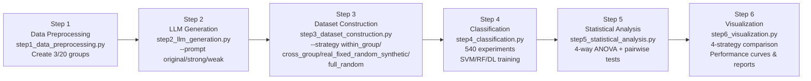

# Synthetic Spam Email Data Generation - Experiment Flowchart

## 详细实验流程图

```mermaid
flowchart TD
    A[CEAS-08 Raw Data<br/>106,412 samples] --> B[Stratified Sampling<br/>Spam:Non-spam = 1:9]

    B --> C[Pilot Study: Create 3 Groups<br/>Each: 200 samples<br/>20 spam + 180 non-spam<br/><br/>Full Study: Create 20 Groups<br/>Each: 9,000 samples<br/>900 spam + 8,100 non-spam]

    C --> D[Train/Test Split<br/>Pilot: 16 spam + 144 non-spam (train)<br/>4 spam + 36 non-spam (test)<br/><br/>Full: 720 spam + 6,480 non-spam (train)<br/>180 spam + 1,620 non-spam (test)]

    D --> E[LLM Synthetic Generation<br/>GPT-4.1-mini on training spam]

    E --> F1[Original Prompt<br/>Generate synthetic from training spam]
    E --> F2[Strong Prompt<br/>Generate synthetic from training spam]
    E --> F3[Weak Prompt<br/>Generate synthetic from training spam]

    F1 --> G[Four Mixing Strategies<br/>Ratios: 0%, 25%, 50%, 75%, 100%]
    F2 --> G
    F3 --> G

    G --> H1[Strategy 1: Within-Group<br/>Real Group i + Synthetic Group i]
    G --> H2[Strategy 2: Cross-Group<br/>Real Group i + Synthetic Group j≠i]
    G --> H3[Strategy 3: Real-Fixed + Random-Synthetic<br/>Real Group i + Random Synthetic]
    G --> H4[Strategy 4: Full-Random<br/>Random Real + Random Synthetic]

    H1 --> I[Train Models<br/>SVM, Random Forest, Deep Learning]
    H2 --> I
    H3 --> I
    H4 --> I

    I --> J[Test on Real Data<br/>Metrics: Acc, Prec, Rec, F1, AUC]

    J --> K[Statistical Analysis<br/>Pilot: 3 groups per condition<br/>Full: 20 groups per condition]

    K --> L[Find Optimal Combination<br/>Best mixing strategy + prompt + ratio + model<br/>540 configs for pilot study]
```

## 技术实现流程图

