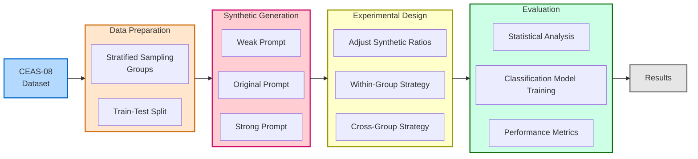

# Methodology Framework Flowchart

This mermaid flowchart visualizes the complete methodology framework for evaluating LLM-generated synthetic spam data with R=20 replication design.

```mermaid
---
config:
  layout: elk
---
flowchart LR
 subgraph B["Data Preparation"]
        B1["Stratified Sampling<br>Groups"]
        B2["Train-Test Split"]
  end
 subgraph C["Synthetic Generation"]
        C1["Original Prompt"]
        C2["Strong Prompt"]
        C3["Weak Prompt"]
  end
 subgraph D["Experimental Design"]
        D1["Within-Group Strategy"]
        D2["Cross-Group Strategy"]
        D3["Adjust Synthetic Ratios"]
  end
 subgraph E["Evaluation"]
        E1["Classification Model Training<br>"]
        E2["Performance Metrics"]
        E3["Statistical Analysis"]
  end
    A["CEAS-08<br>Dataset"] --> B
    B --> C
    C --> D
    D --> E
    E --> F["Results"]
    style A fill:#b3d9ff,stroke:#0066cc,stroke-width:2px
    style B fill:#ffe6cc,stroke:#cc6600,stroke-width:2px
    style C fill:#FFCDD2,stroke:#cc0066,stroke-width:2px
    style D fill:#ffffcc,stroke:#999900,stroke-width:2px
    style E fill:#ccffe6,stroke:#006600,stroke-width:2px
    style F fill:#e6e6e6,stroke:#666666,stroke-width:2px

```