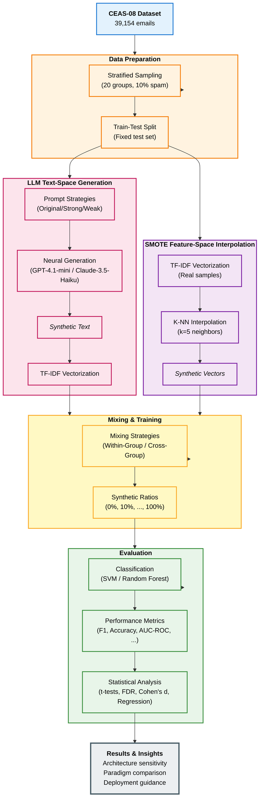

# Methodology Framework Flowchart

This mermaid flowchart visualizes the complete methodology framework comparing traditional feature-space augmentation (SMOTE) and neural text-space generation (LLMs) with systematic replication (R=20).

## Key Components

### Data Preparation
- **Stratified Sampling**: 20 independent groups, each with 1,000 samples (10% spam)
- **Fixed Test Set**: Consistent evaluation across all experiments

### Paradigm Comparison

**LLM Text-Space Path:**
1. Prompt engineering (3 strategies)
2. Neural generation (2 models: GPT-4.1-mini, Claude-3.5-Haiku)
3. Produces interpretable synthetic text
4. Vectorization applied to synthetic text

**SMOTE Feature-Space Path:**
1. Vectorization applied to real samples first
2. K-nearest neighbors interpolation (k=5)
3. Produces abstract synthetic feature vectors (no text)

### Experimental Design
- **Mixing Strategies**: Within-group vs Cross-group
- **Synthetic Ratios**: 11 levels (0%, 10%, 20%, ..., 100%)
- **Total Configurations**: 1,760 LLM + 440 SMOTE = 2,200 experiments

### Evaluation Framework
- **Classifiers**: SVM (margin-based) vs Random Forest (ensemble-based)
- **Metrics**: 7 classification metrics (F1 as primary)
- **Statistical Analysis**: Hypothesis testing, effect sizes, sensitivity regression
